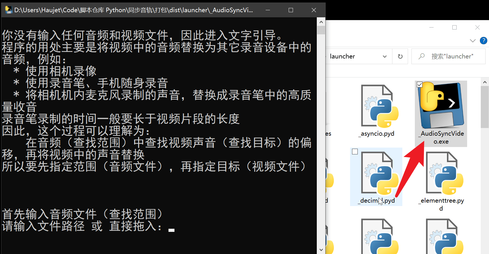

[中文](./README.md)　|　[English](./README_en.md) 

[Gitee](https://gitee.com/haujet/audio-video-resync)　|　[Github](https://github.com/HaujetZhao/audio-video-resync) 

# Audio-Video-Resync

## ⭐ 简介

功能： 通过波形比较，得到两个音频的时间戳偏移值，合成新视频。 

大白话：将视频中的声音替换成录音笔中的声音，并自动对齐。

用途示例： 录制 vlog时，使用录音笔实现更好的收声，再将相机的视频与录音笔的录音同步。

下载：

- 发行版下载地址： [Releases](../../releases) 

## 📝 背景

最近了解了录音笔，知道了在 vlog 中的一个技巧：

> * 使用相机录视频，得到高质量的视频
>
> * 将录音笔 / 手机带在身上，录音，得到高质量的收声
>
> 后期将 **相机的视频** 和 **录音笔的录音** 对齐，转换音轨，得到画面和音质都完美的视频。

但是这个替换过程是比较繁琐的，即便 Pr、Davinci 这些专业软件中有音频对齐功能，但光打开这些软件，还没开始剪辑就够卡的了，导出时还要重新压制，实在是不好用。就以达芬奇为例，特别吃显卡，我这个独显笔记本，不剪视频，就单单打开达芬奇，切换操作界面都卡。

我就想，假如以后给女朋友拍视频，用录音笔这种方式获得完美的收声后，简单替换音频这件小事，需要一个简单的一步操作，我需要一个轻量的工具，只修改音频，导出无损的视频。

经过搜索，在 github 上，我找到了 [BBC 的 audio-offset-finder](https://github.com/bbc/audio-offset-finder)，可以分析两段声音之间的偏移时间，但它是用 python2.7 写的，然后我找到了 [abramhindle 教授的](https://github.com/abramhindle) 的 [audio-offset-finder fork](https://github.com/abramhindle/audio-offset-finder) ，他用 python3 进行了重新实现和优化，[benkno 的 audio-offset-finder fork]( https://github.com/benkno/audio-offset-finder) 又做了 bash 处理的优化。

经上述两个 fork 的优化，audio-offset-finder 的大概原理就成了：

> 取音频 1 的大约前 30 秒片段，得到特征值，在音频 2 的前 15 分钟片段中，寻找特征最接近的地方，得到偏移值，再替换音频，生成新视频。

上述的缺点是：如果时间位移超过 15 分钟，就分析不好了。

所以我做了些改进：

> 依次取音频 1 、音频 2、……音频 n 的大约前 20 - 50 秒片段，得到特征值，在音频 2 ，以 15 分钟为一小段，对每一段依次寻找特征最接近的地方，直到找到合格的相似点，得到偏移值，再替换音频，生成新视频。

所以你可以用录音笔一次录上好几小时的音频，中途用相机录上几段视频，用一条命令，将这些视频的音频，全部替换成录音笔音频中的片段：

```
audio-video-resync 录音笔音频.mp3 相机视频1.mp4 相机视频2.mp4 相机视频3.mp4
```

## ✨ 特性

两种运行方式：

* 直接运行，文字引导
* 命令行运行，一条命令处理多个视频

## 🛠️ 安装

### 📦 发行版

需要提前安装上 FFmpeg

已为 Windows 64 位打包成可直接双击运行的包，请到 [本仓库的 Releases](../../releases) 界面下载。将 7z 压缩包解压后，文件夹内有一个 exe 文件，双击即可运行：

 

也可以从命令行运行：

```
_AudioSyncVideo.exe 录音笔音频.mp3 相机视频1.mp4 相机视频2.mp4
```

其他系统需要从源代码使用

### ⚙️ 用 pip 安装运行

需要提前安装上 FFmpeg 和 Python3

#### 用 pip 从 pypi 安装

还未上传

#### 用 pip 从源代码安装

将仓库克隆下来，进入仓库文件夹，运行：

```
pip install .
```

就安装上了。然后就可以运行以下命令使用了：

```
audio-video-resync
```

### 📄 从源代码直接运行

将仓库克隆下来，进入仓库文件夹，先安装依赖库：

```
pip install -r requirements.txt
```

然后就可以以模块的方式运行：

```
python -m audio_video_resync
```


## 💡 使用

```
python -m audio_video_resync
```

```shell
python -m audio_video_resync 录音笔音频.mp3 相机视频1.mp4 相机视频2.mp4 相机视频3.mp4
```

第一种方式是直接运行，会有文字提示引导你：

```
> python -m audio_video_resync
正在初始化，请稍等

你没有输入任何音频和视频文件，因此进入文字引导。
程序的用处主要是将视频中的音频替换为其它录音设备中的音频，例如：
  * 使用相机录像
  * 使用录音笔、手机随身录音
  * 将相机机内麦克风录制的声音，替换成录音笔中的高质量收音
录音笔录制的时间一般要长于视频片段的长度
因此，这个过程可以理解为：
    在音频（查找范围）中查找视频声音（查找目标）的偏移，再将视频中的声音替换
所以要先指定范围（音频文件），再指定目标（视频文件）


首先输入音频文件（查找范围）
请输入文件路径 或 直接拖入：音频.mp3

再输入视频文件（查找目标）
请输入文件路径 或 直接拖入：视频.mp4

总共有 1 个视频需要对齐，正在对齐第 1 个：视频.mp4
```

第二种方式是命令行传递参数运行，可以一次传递 **一个音频** 和 **多个视频** ：

```
> python -m audio_video_resync -h
usage: audio_video_resync [-h] [--version] [--offset Minutes]
                   [--trim Minutes] [--sr SampleRate]
                   [--format Format] [--not-generate] [--plotit]
                   Audio Video [Video ...]

功能： 通过波形比较，得到两个音频的时间戳偏移值，合成新视频。 用途示例： 录制 vlog
时，使用录音笔实现更好的收声，再将相机的视频与录音笔的录音同步。

positional arguments:
  Audio             外置音频，在这个文件中进行匹配
  Video             对此视频文件匹配偏移（可一次添加多个文件）

optional arguments:
  -h, --help        show this help message and exit
  --version         show program's version number and exit
  --offset Minutes  忽略外置音频的前多少分钟 (default: 0)
  --trim Minutes    只使用音频文件的前多少分钟进行分析 (default: 15)
  --sr SampleRate   重新采样进行分析时，使用什么采样率 (default: 16000)
  --format Format   输出文件的格式，例如：mp4、mkv (default: mp4)
  --not-generate    不要运行 FFMPEG 生成同步好的新视频 (default: False)
  --plotit          展示相关性计算结果的图示 (default: False)
```

## 🔋 打赏

本软件完全开源，用爱发电，如果你愿意，可以以打赏的方式为我充电：


## 😀 交流

如果有软件方面的反馈可以提交 issues，或者加入 [QQ 群：1146626791](https://qm.qq.com/cgi-bin/qm/qr?k=DgiFh5cclAElnELH4mOxqWUBxReyEVpm&jump_from=webapi) 